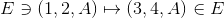

# inv_chk
Invariant Checking for type graph language based on core graph computation 

## Installation:

This tool is based on cores.py from: [CoReS](https://github.com/mnederkorn/CoReS)  
To run inv_chk you need to make cores.py available in your python context. The easiest way to do this, is by putting inv_chk.py in the same folder as cores.py.

## Usage:

### GUI

To run inv_chk with a GUI, just start it without any parameters.

After loading a file, you can initiate the invariance check via the "chk_inv" button. After the check is done you can select which rule out of the entire problem instance you want to be shown. If the type graph is know to not be invariant under the selected rule, the t_L morphism for which there exists no fitting t_R is shown as a color coding within graph L and core(T).

### CLI

To run inv_chk via CLI, pass it a filepath to a problem instance, e.g.:  
```python .\inv_chk.py "C:\Users\Maxime\Documents\GitHub\inv_chk\rules\bipartite_inv.txt"```

A problem instance is formated as follows:
```
T:
[type graph]
rules:
[list of rules]
```  
A rule is formated as follows:
```
I:
[interface graph]
L:
[left graph]
R:
[right graph]
morphL:
[morphism from the interface graph to left graph]
morphR:
[morphism from the interface graph to right graph]
```  
A graph is formated as follows:  
First line is a list of space separated integers which name the nodes of the graph.
All following lines consist of a single integer representing the source node of an edge, followed by a space and another integer representing the target node, followed by a space and a single capital letter denominating the label of the given edge.  
A morphism is formated as follows:
```
V:
[list of node mappings]
E:
[list of edge mappings]
``` 
Mappings are formated as follow:
```  
[some node/edge in I]->[some node/edge in L/R]
``` 
To specify an edge in morphism you concatenate its source and target node as well as its label with spaces.  
E.g.:  would be written as:  
```1 2 A->3 4 A```

Examples:  
[bipartite_inv](rules/bipartite_inv.txt)  
[bipartite_not_inv](rules/bipartite_not_inv.txt)
